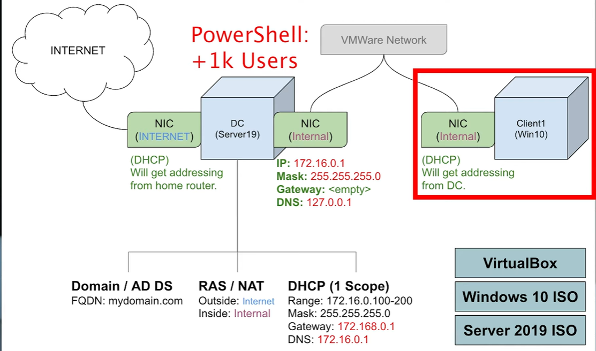
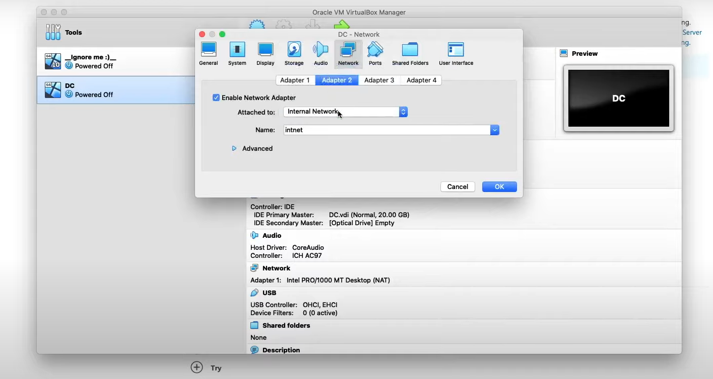
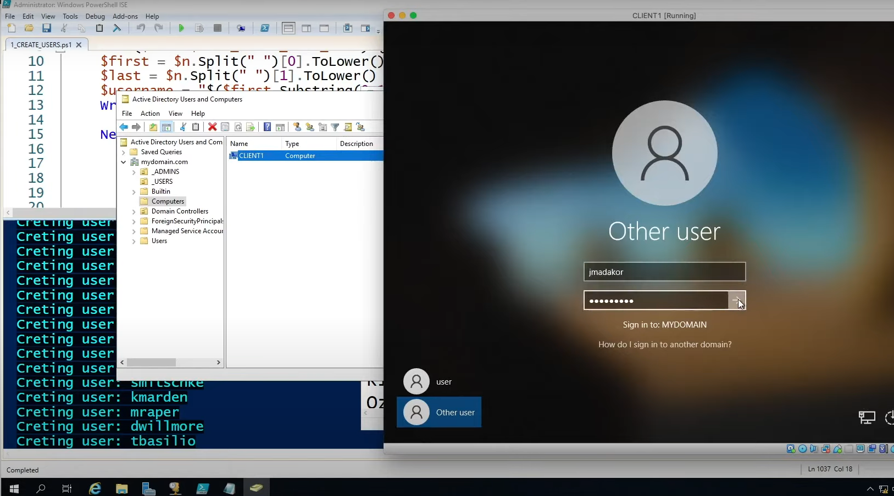

<h1>Active Directory Setup</h1>

<h2>Description</h2>
This simulation consists of using Virtual Box to simulate Domain controller to add users to our Active Directory Setup. I used Windows 10 installed Virtual Machines to simulate Clients and We also use a powershell script to simulate Adding 1000 users to the active directory 
 

<h2>Languages and Utilities Used</h2>

- <b>PowerShell</b> 

<h2>Environments Used </h2>

- <b>Windows Server 19(Domain Controller)</b> 
- <b>Windows 10</b> (21H2)
- <b>VirtualBox</b> 

<h2>Simulation walk-through:</h2>

Architecture for the simulation :  

 
 
Setup Domain Controller in Virtual Box:  

 
 
Install Active Directory Software onto The domain controller :   

 
 
Configuring DHCP:  

 
 
NAT Setup 

 
 
Run powershell Script in the VM to add users from text file  

 
 
Create Client VM  

 
 
Verify the users that have been added can access the Network using credentials  

 
 

